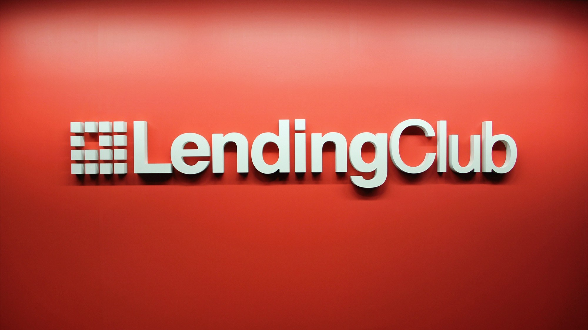
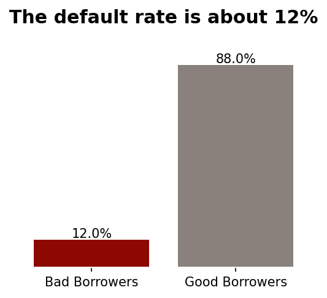
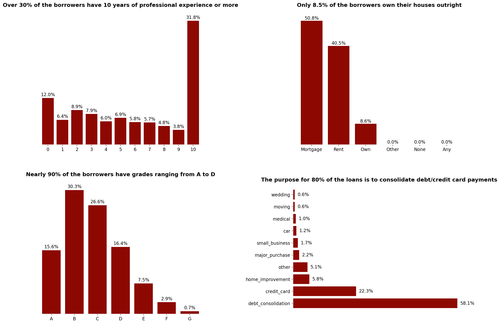
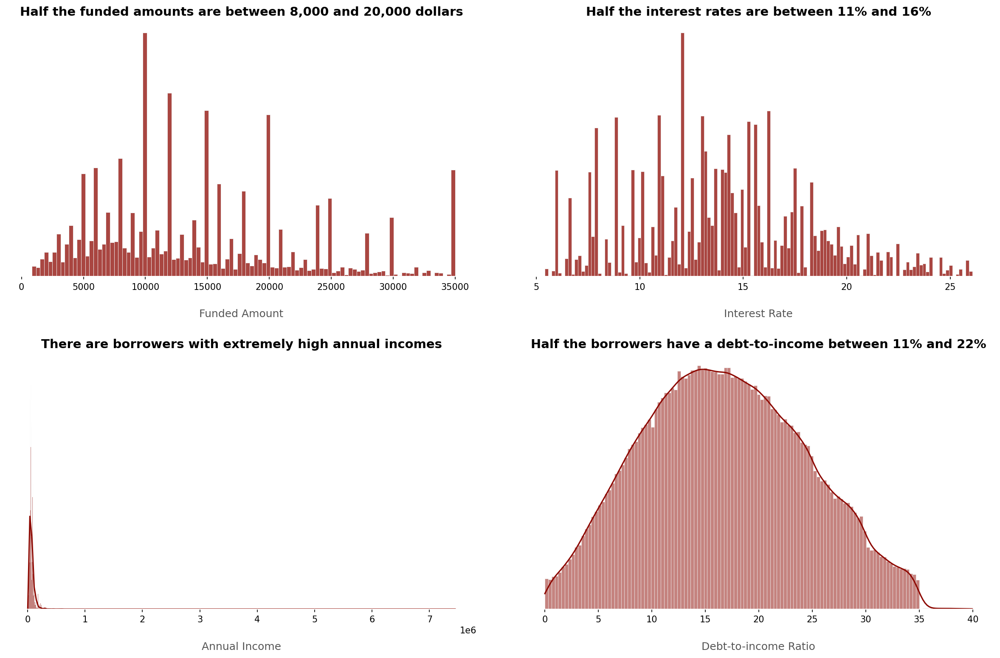
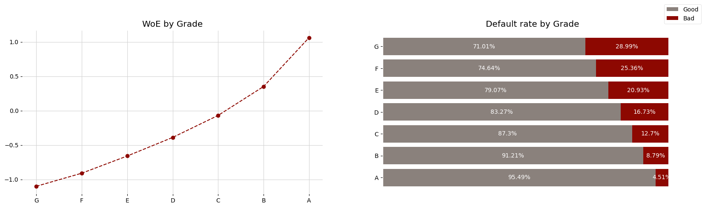
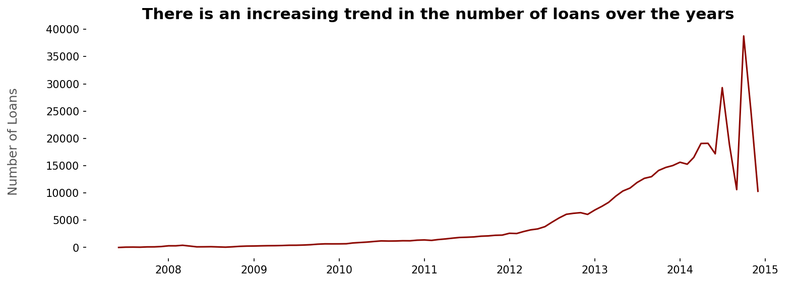
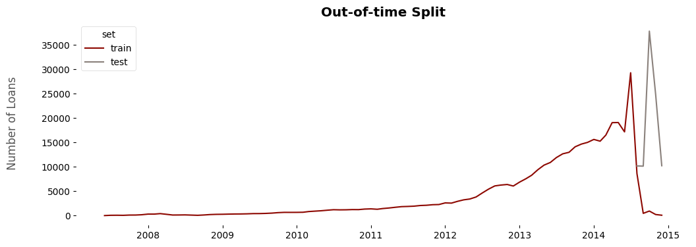
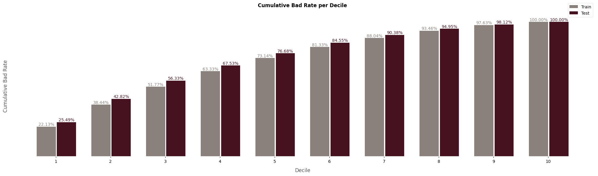
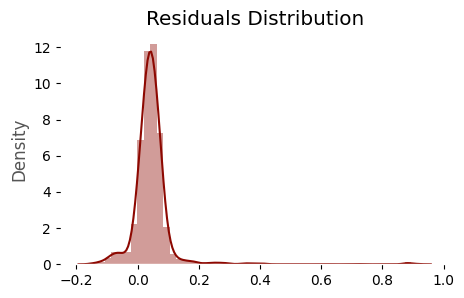
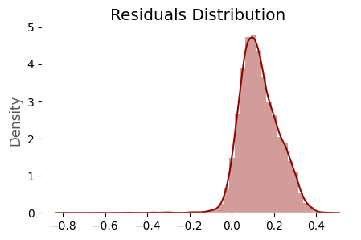

# Lending Club Credit Scoring

# 1. Project Description
- In this project, I will build three **machine learning** models to predict the three components of expected loss in the context of **credit risk modeling** at the **Lending Club** (a peer-to-peer credit company): **Probability of Default (PD), Exposure at Default (EAD) and Loss Given Default (LGD)**. The expected loss will be the product of these elements: **Expected Loss (EL) = PD * EAD * LGD**. These models will be used to stablish a **credit policy**, deciding wheter to grant a loan or not for new applicants **(application model)** based on their **credit scores** and **expected losses** on loans. By estimating the Expected Loss (EL) from each loan, the Lending Club can also assess the required capital to hold to protect itself against defaults.
- The PD modelling encompasses an imbalanced binary classification problem with target being 1 in case of non-default and 0 in case of default (minority class). A Logistic Regression model will be built. 
- The LGD and EAD modelling encompasses a beta regression problem, that is, a regression task in which the dependent variables are beta distributed, the recovery rate and credit conversion factor, respectively.

# 2. Business Problem and Objectives
**2.1 What is the Lending Club?:**
- LendingClub is a **peer-to-peer lending platform** that facilitates the borrowing and lending of money directly between individuals, without the need for traditional financial institutions such as banks. The platform operates as an online marketplace, connecting borrowers seeking personal loans with investors willing to fund those loans.

**2.2 What is the business problem?**
- LendingClub faces a significant business challenge related to **managing default risks effectively** while **optimizing returns** for its investors. The platform facilitates peer-to-peer lending, connecting borrowers with investors, and relies on **accurate risk assessments to maintain a sustainable and profitable lending ecosystem.** Thus, the CEO wants us to provide insights about which factors are associated with credit risk in Lending Club's operations, and to construct models capable of predicting the probability of default for new applicants and possible losses on its loans in order to establish a credit policy, deciding when to grant a loan or not for an applicant. An important observation is that the CEO wants these models to be easy to understand. Since our company works on the internet, making customers happy and being clear is really important. So, we need to be able to explain why we decide to approve or deny a loan.

**2.3 Which are the project objectives and benefits?**
1. Identify the factors associated with **credit risk** in the form of business **insights.**
2. Develop an accurate **Probability of Default (PD) Model**, constructing a scorecard. This will allow Lending Club to decide wheter to grant a loan or not to a new applicant (**application model**), based on **credit scores.**
3. Develop **Exposure at Default (EAD) and Loss Given Default (LGD) Models**, to estimate the **Expected Loss** in loans. This will allow Lending Club to **hold** sufficient **capital** to protect itself against default in each loan.
4. Improve **risk management** and optimize **returns** by establishing a **credit policy**, trying to balance risk and **ROI** of Lending Club's assets.
5. Apply **model monitoring** and maintenance techniques to safeguard our results from population instability, characterized by significant changes in loan applicants' characteristics. This will allow us to understand whether the built model is still useful in the future or whether the loan applicants characteristics changed significantly, such that we will need to redevelop it.

**2.4 Which are the important concepts to know in the context of credit risk?**
- **Financial institutions**, like LendingClub and online lending platforms, **make money by lending to people and businesses.** When they lend money, they **charge interest**, which is a significant source of their **profits**. **Managing credit risk well is crucial** for these institutions. This means ensuring that borrowers pay back their loans on time to avoid losses.
- **Credit risk** is the possibility that a borrower might not fulfill their financial obligations, leading to a loss for the lender. If a borrower fails to meet the agreed-upon terms, it's called a "default," and it can result in financial losses for the lender. The **default** definition is associated with a time horizon. For example, if a borrower hasn't paid their debt within 90 days of the due date, they are considered in default.
- In the credit market, important **rules** help keep things honest and clear. **Basel III** is one such set of rules, making sure banks have **enough money (capital requirements)** and follow **guidelines for assessing loan risks**. The **Internal Rating-Based Approach (IRB-A)** lets banks figure out credit risks using concepts like Probability of Default (PD), Exposure at Default (EAD), and Loss Given Default (LGD). Another rule, **International Financial Reporting Standard 9 (IFRS 9)**, gives standards for measuring financial assets. It's special because it looks at the chance of a loan not being paid back over its entire life, unlike Basel, which checks it for one year. These rules help banks have enough money, handle risks well, and keep the credit market steady and trustworthy.
- The **"expected loss (EL)"** is the average estimated loss that a lender can expect from loans that default. It involves three factors: the **probability of default (likelihood of a borrower defaulting)**, **loss given default (portion of the amount the bank is exposed to that can't be recovered in case of default)**, and **exposure at default (potential loss at the time of default, considering the outstanding loan amount and other factors)**.
- **LendingClub**, operating as a peer-to-peer lending platform, uses a **"PD Model/Credit Scoring Model" to assess borrowers' creditworthiness using credit scores**. This helps determine the **likelihood of loan repayment**, guiding the decision to **approve or deny the loan.** The **required capital to guard against default** for each loan is calculated using **EAD and LGD Models** to estimate the **Expected Loss (EL)**, contributing to minimizing risk in credit operations.
- When creating a Credit Scoring Model, which assesses creditworthiness for loan approval, using data available at the time of the application is considered an **"application model."** It is distinct from a **"behavior model."** This is the model I will build here.
- A **"credit policy"** is a set of guidelines that financial institutions follow to evaluate and manage lending risk. Factors such as the expected ROI for each loan application, credit scores, risk classes, expected losses, and so on, are included.
- **"Return on Investment (ROI)"** is a key measure of loan profitability. Balancing ROI with risk is vital for effective credit policy management. While higher-risk loans may offer more significant potential returns, they also come with a higher chance of default.

# 3. Solution Pipeline
The **solution pipeline** is based on the **crisp-dm** framework:
1. Business understanding.
2. Data understanding.
3. Data preparation.
4. Modelling.
5. Validation.
6. Deployment.

# 4. Technologies and Toools Used
- Python (Pandas, Numpy, Matplotlib, Seaborn, Sciki-Learn, Statsmodels, Virtual Envs).
- Machine learning classification and regression algorithms.
- Statistics.
- Data cleaning, manipulation, visualization and exploration.

# 5. Project Structure
- **Artifacts:** Contains the machine learning models artifacts, such as the pkl files.
- **Input:** Contains the raw input data and data dictionary.
- **Notebooks:** Contains all jupyter notebooks developed. It is the research environment
- **Reports:** Contains images for storytelling.
- **Src:** Contains python scripts including eda and modeling utils, exception and logger.
- **Requirements.txt** and **setup.py** are tools to build my project as a package.

# 6. Main Business Credit Risk Insights
Lending Club's current investment portfolio presents the following characteristics:

**6.1 Personal Indicators:**
- Approximately 12% are defaulters/bad borrowers.
- Nearly three out of four loans have a 36-month term.
- More than 75% have at least 2 years of professional experience, with over 30% having ten years or more.
- Over 90% own a house through a mortgage or pay rent, while only 8.5% own their houses outright.
- Nearly 90% have grades ranging from A to D, while grades F and G make up less than 4% of the borrowers.
- The reason for taking out 80% of the loans is to either consolidate debt or use them for credit card payments.
- Over 15% live in California.
- Everything pointed out above suggests a conservative profile among applicants: older individuals with financial and professional stability.

**6.2 Financial Indicators:**
- The maximum funded amount is $35,000, with 50% falling in the range of $8,000 to $20,000. The average is around $14,000.
- Half of the interest rates range between 11% and 16.8%, with a maximum charge of 26% and a minimum of 5.42%.
- The average annual income is $72,970, but this value can vary significantly, including individuals with extremely high incomes. It is extremely right-skewed.
- Half have a debt-to-income ratio up to 16.6%.
- Half have a credit limit ranging from $13,500 to $37,300. However, similar to annual income, this value can vary significantly, including individuals with extremely high credit limits.
- Everything pointed out above suggests a conservative investment portfolio, with no high funded amounts or interest rates charged. 

**6.3 Credit Risk Indicators:**
- There is a monotonic decrease in default rate as the applicant's grade improves (from G to A). Higher grades correspond to lower credit risk, with the bad rate for G-grade being 6.4 times higher than that for A-grade.
- The bad rate consistently increases as the interest rate rises, indicating that higher interest rates are associated with higher credit risk. Loans with more than 20% interest rate have a bad rate approximately 8 times higher than those with 5% to 7% interest rates.
- The bad rate consistently decreases as annual income increases, reflecting that lower annual incomes are associated with higher credit risk. For instance, individuals with annual incomes from 1,748 dollars to 24,111 dollars have a bad rate about two times higher than those with annual incomes of 120,000 dollars or higher. The same pattern holds for the debt-to-income ratio.

**6.4 Conclusion:**
- There is an observed increasing trend in the number of loans granted over time.
- Although Lending Club has a conservative portfolio, the default rate is very high, and motivates our project. It needs to manage risks effectively to maximize profit and maintain healthy business. 
    

# 7. Modeling

**7.1 Data Cleaning:**
- First of all, **data cleaning** was performed to turn the raw data suitable for data exploration and modeling. Tasks performed in this step:
- Obtain a sorted dataframe, providing a chronological order for the loan data.
- Remove features with higher than 70% missing rate, excessive cardinality, unique values per observation, no variance/constant values, and irrelevant variables to the business or modeling point of view.
- Treat missing values, removing observations with missings when they represent a very small portion of the data and imputing them when they represent a specific value, like zero.
- ⁠Convert features to correct data type (object to datetime and int).
- ⁠Create new independent features.
- ⁠Create the target variables for the PD (stablishing a default definition and assigning 1 to good borrowers and 0 to bad borrowers in order to interpret positive coefficients as positive outcomes), EAD (credit conversion factor) and LGD (recovery rate) models.
- ⁠Search and fix inconsistent outlier values.
- ⁠Optimize memory, obtaining a final parquet file.
- As a result, we went from 75 features to a dataset with 42 variables in its correct data types, optimized in terms of memory usage, with some missing values and outliers treat and new useful extracted features. 

**7.2 Exploratory data analysis:**
- The goal of the exploratory data analysis was to **investigate Lending Club's current investment portfolio's personal, financial, and credit risk indicators**, as previously mentioned. Additionally, in this step, I **determined** the final set of **dummy variables** to construct for the **PD Model**, essentially outlining the preprocessing steps to be undertaken.
- Due to interpretability requirements, the PD Model must include only dummy variables. To create these dummies, I analyzed the discriminatory power of each categorical and numerical variable by assessing the **Weight of Evidence (WoE)** for each category. Subsequently, using both the WoE values and the proportion of observations, I grouped categories together to construct additional dummies. The goal was to **combine** similar credit risk/WoE **categories** and categories with low proportions of observations (to prevent overfitting). An important observation is that the highest credit risk or lowest WoE categories, the reference categories, were separated for further dropping, in order to avoid multicolinearity issues (dummy variable trap). 
- For **continuous features**, I applied **feature discretization** to facilitate this categorical analysis. Discretizing continuous features allows for a more comprehensive understanding of their relationship with the target variable. This process helps minimize the impact of outliers and asymmetries, enables the assessment of potential linear monotonic behaviors, and provides the opportunity to apply treatments when such behaviors are not observed. It's important to note, however, that discretization comes at the cost of increased dimensionality and a loss of information.

**7.3 PD Modeling:**
- In PD modeling, I initially excluded variables that would not be available at the time of prediction to prevent data leakage, such as the funded amount or total payments. Additionally, I eliminated variables that demonstrated no discriminatory power during the Exploratory Data Analysis (EDA).
- Subsequently, I conducted an **out-of-time train-test split**, which is considered the best approach for PD, EAD, and LGD Modeling. This is crucial as we construct models using past data to predict future applicants' data.

- Following this, I applied the necessary **preprocessing**, creating the **dummy variables** determined in the EDA step. I discretized the identified continuous features and then grouped all the specified categories to obtain the final dummies, eliminating the respective reference categories. An important observation is that I considered missing values in a variable as another category of it, because they showed a higher proportion of defaults, not being missing values at random.
- Once the data was preprocessed, I estimated the **PD Model using hypothesis testing to evaluate p-values** for the predictor variables. This helped determine whether these variables were statistically significant (i.e., had a coefficient different from zero) or not.
- Independent variables with all dummies containing p-values higher than an alpha of 0.05 were removed, simplifying the model.
- **Interpretation of the coefficients** was performed. For instance, considering the coefficient for sub_grade_A3_A2_A1 as 0.694287, we can infer that the odds of being classified as good for a borrower with A1/A2/A3 subgrades are exp(0.694287) = 2.0 times greater than the odds for someone with G1/G2/G3/G4/G5/F2/F3/F4/F5 subgrades (the reference category).
- Subsequently, I **evaluated the PD Model** by dividing the **scores** into **deciles** and assessing whether there was **ordering** in them. Indeed, in both the training and test data, there was a clear ordering: the lower the credit risk or the higher the score, the lower the bad rate. Moreover, more than 50% of the bad borrowers were observed up to the third decile/score.

- Furthermore, with a **KS** of approximately **0.3**, an **ROC-AUC** of around **0.7**, and a **Gini** coefficient of about **0.4** on the test set, the application model exhibits **satisfactory performance**. The model demonstrates effective discriminatory power, distinguishing well between good and bad borrowers. Examining the **Brier** Score, it is very **close to zero**, indicating that the model presents **well-calibrated probabilities** or scores. Furthermore, the **train and test scores** for each of these metrics are quite **similar**. Consequently, the model is not overfitted, has captured the underlying patterns within the data, and is likely to distinguish well between good and bad borrowers in new, unseen data.

| Metric | Train Value | Test Value |
|--------|-------------|------------|
| KS     | 0.268181    | 0.297876   |
| AUC    | 0.683655    | 0.703449   |
| Gini   | 0.367310    | 0.406897   |
| Brier  | 0.100512    | 0.061633   |

- Finally, a **scorecard** was developed, transforming the coefficients from the PD Model into easily interpretable integer values known as scores. Various formulas were employed to compute these scores, with a minimum score of 300 and a maximum of 850. Subsequently, **credit scores** were **calculated for all borrowers** in both the training and test datasets by multiplying each dummy by its scores and summing the intercept.

**7.4 EAD and LGD Modeling:**
- Initially, I **isolated data containing defaulted loans with a "charged off" status**, ensuring sufficient time had passed for potential recoveries.
- Similar to the PD Model, I excluded irrelevant variables and those that could introduce data leakage.
- Subsequently, I performed an **out-of-time train-test split**, following the same approach as with the PD Model.
- Following this, I **investigated both dependent variables:**
    - The dependent variable for the **LGD Model** is the **recovery rate**, defined as recoveries divided by the funded amount. Although LGD represents the proportion of the total exposure that cannot be recovered by the lender when the borrower defaults, it is common to model the proportion that CAN be recovered. Thus, **LGD** will be equal to **1 minus the Recovery Rate.**
    - The dependent variable for the **EAD model** is the **credit conversion factor**, representing the proportion of the funded amount outstanding to pay. Therefore, **EAD** equals the **funded amount multiplied by this credit conversion factor.**
    - Almost **50% of the recovery rates were zero.** Consequently, I opted to **model LGD using a two-stage approach**. First, a logistic regression predicts whether the recovery rate is greater than zero (1) or zero (0). Then, for those predicted as greater than zero, a linear regression estimates its corresponding value.
    - The credit conversion factor exhibited a reasonable distribution, leading me to decide on estimating a simple linear regression.
    - An important observation is that, although LGD and EAD are beta-distributed dependent variables, representing rates, and beta regression is more suitable for estimating them, I tested it against Linear Regression, and almost the same result was achieved. Thus, considering the need to treat 0 and 1 values for beta regression (e.g., replacing them with 0.0001 and 0.9999), for simplicity, I proceeded with linear regression.
- **Data preprocessing** involved one-hot encoding for nominal categorical variables, as linear models benefit from this encoding. For ordinal categorical variables, ordinal encoding was applied to reduce dimensionality and preserve ordering information. Standard scaling was applied to both ordinal encoded and numerical variables since linear models are sensitive to feature scaling. Missing values were imputed with the median due to an extremely right-skewed variable distribution.
- I estimated the two-stage LGD and EAD Models. For LGD, I combined the two predictions by taking their product. Predictions from the first stage logistic regression that predicted a recovery rate of zero remained zero, while those predicted as one received the estimated value from the second stage linear regression.
- The **results were satisfactory**, although not impressive. Both models' **residuals distributions resembled a normal curve**, with most values around zero. Additionally, some tails were observed, indicating that the LGD Model tends to underestimate the recovery rate, and the EAD tends to overestimate it. However, with a **Mean Absolute Error (MAE) of 0.0523 and 0.1353** for the LGD and EAD Models, respectively, the models provide useful predictions. On average, the predicted recovery rates deviate by approximately 5.23 percentage points from the actual values. On average, the predicted credit conversion rates deviate by approximately 13.53 percentage points from the actual values.

Residuals distribution and actual vs predicted values for the LGD Model.

| Actual | Predicted | Residual |
|--------|-----------|----------|
| 0.06   | 0.10      | 0.05     |
| 0.15   | 0.10      | 0.05     |
| 0.14   | 0.15      | 0.01     |
| 0.16   | 0.12      | 0.05     |
| 0.15   | 0.09      | 0.06     |

Residuals distribution and actual vs predicted values for the EAD Model.

| Actual | Predicted | Residual |
|--------|-----------|----------|
| 0.93   | 0.82      | 0.11     |
| 0.90   | 0.84      | 0.06     |
| 0.73   | 0.64      | 0.09     |
| 0.96   | 0.64      | 0.31     |
| 0.64   | 0.70      | 0.06     |

**7.5 Expected Loss (EL) and Credit Policy:**
- To compute **Expected Loss (EL)**, which is the **product of Probability of Default (PD), Exposure at Default (EAD), and Loss Given Default (LGD)**, I leveraged the results of the three models (PD, EAD, and LGD Models) on the test data used for testing the PD Model, encompassing both default and non-default loans.
- I **created 10 risk classes (AA, A, AB, BB, B, BC, C, CD, DD, F)** based on the probability of default because this way we can better leverage the results of the credit scoring model, and it is possible to establish different policies for individuals in different risk classes.
- In this context, **Lending Club** is adopting a more **conservative profile** with a focus on the **profitability** of its assets. The goal is to mitigate risks associated with higher-risk and potential default loans while maximizing profitability.
- To achieve this, the **CEO has outlined a conservative credit policy:** We will automatically approve loans for applicants who fall into AA and A risk classes (indicating the lowest credit risk and highest credit scores) and automatically deny those who fall into the F class (indicating the highest credit risk and lowest credit scores). For the other classes, the loan must provide an annualized Return on Investment (ROI) greater than the basic United States interest rate. This criterion aligns with the rationale that if a loan's expected ROI doesn't surpass this interest rate, it may be more prudent to invest in less risky options, such as fixed-income investments.
- Considering the data goes up until 2015, I assumed that the United States has a basic interest rate of 2.15%.
- As a **financial result**, with our simple credit policy rules, by rejecting just 11% of the loans (including those belonging to the worst risk class, F, and those with an annualized ROI lower than 2.15, the basic US interest rate), both the amount Lending Club expects to lose in its assets and the default rate decreased. Specifically, the **default rate decreased from 6.71% to 5.65%** and the **Expected Loss decreased from 6.91% to 5.77%.** Although these represent **little percentage points** decreasement, when dealing with **thousands of loans** and funded amounts, it represents a **substantial financial gain to Lending Club.** Furthermore, other policies can also be designed, in a more restrictive or free way. This is just a draw to show that our project is worthwile.

**7.6 Model Monitoring:**
- Imagine a year has passed since we built our PD model. Although it is very unlikely, the people applying for loans now might be very different from those we used to train our PD model. We need to reassess if our PD model is working well.
- If the population of the new applicants is too different from the population we used to build the model, the results may be disastrous. In such cases, we need to redevelop the model.
- I applied **model monitoring to our PD Model one year after its construction, using 2015 loan data**. Model monitoring aims to observe whether applicants' characteristics remain consistent over time. The fundamental assumption in credit risk models is that future data will resemble past data. If the population changes significantly, it may be necessary to retrain the model. To assess differences between the actual (training data) and expected (monitoring data), the **Population Stability Index (PSI)** was calculated for each variable.
- Initial list status exhibited the highest PSI, nearly equal to 0.25, indicating a substantial change in the applicants' population. However, this change is more likely due to shifts in the bank's strategies than changes in the borrowers' characteristics.
- On the other hand, **credit scores** showed a PSI of 0.19, close to 0.25. This suggests that we may need to construct another PD Model in the near future. This represents a **significant population change, implying that our model outputs are considerably different from those observed previously.**

**7.7 Next steps:**
- Considering the 2015 applicants' profile has changed, especially the scores distribution, the next steps involve constructing a new PD Model utilizing more robust methods, such as boosting algorithms, focusing on predictive power and trying to use machine learning interpretability tools such as SHAP and LIME.
- As a final product, I intend to deploy these models on production environment.

# 8. Obtain the Data
- The data was collected from kaggle and contain complete loan data for all loans issued through the 2007-2015, including the current loan status (Current, Late, Fully Paid, etc.) and the latest payment information.
- https://www.kaggle.com/datasets/wordsforthewise/lending-club

# 9. Run this Project on Your Local Machine
- An important observation is that, due to the large size of the data, it was not possible to push it to GitHub. To replicate the same results, please download the data from the link provided in topic 8 and read it into the data cleaning notebook. The cleaned data is saved in the input directory, so after the data cleaning process, everything should run smoothly.

Prerequisites:

Before getting started, make sure you have the following installed on your machine:
- Python 3.11.5
- pip (Python package manager)
- Git (Version control tool)

Once you have this installed, open a terminal on your local machine and run the following commands:

1. Clone the repository:
<pre>
git clone https://github.com/allmeidaapedro/Lending-Club-Credit-Scoring.git
</pre>

2. Navigate to the cloned repository directory:
<pre>
cd Lending-Club-Credit-Scoring
</pre>

3. Create a virtual environment:
<pre>
python -m venv venv
</pre>

4. Activate the Virtual Environment:

Activate the virtual environment used to isolate the project dependencies.
<pre>
source venv/bin/activate  # On Windows, use 'venv\Scripts\activate'
</pre>

5. Install Dependencies:

Use pip to install the required dependencies listed in the requirements.txt file.
<pre>
pip install -r requirements.txt
</pre>

6. Run the notebooks in the notebooks directory and reproduce the same results.

7. Deactivate the Virtual Environment:

When you're done with the project, deactivate the virtual environment.

<pre>
deactivate
</pre>

# 10. Contact me
- Linkedin: https://www.linkedin.com/in/pedro-almeida-ds/
- Github: https://github.com/allmeidaapedro
- Gmail: pedrooalmeida.net@gmail.com

